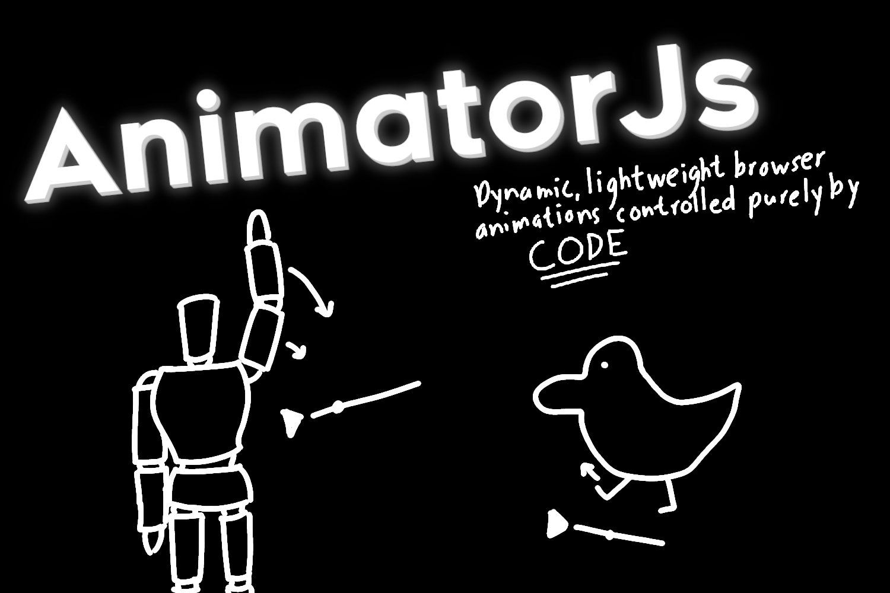

# AnimatorJs
A javascript animation viewer based on a custom animation API primarily designed for p5.js and allows for dynamic, lightweight, real-time rendered browser animations controlled purely by code.

(This differs from projects like Motion Canvas since it's meant for smaller lightweight animations that are to be rendered in real time like in games or web applications)

You can use the editor here: https://randomgamingdev.github.io/AnimatorJs/

If you want to modify it, for instance to by default add your own library, simply fork this repo, add it into [index.html](https://github.com/RandomGamingDev/AnimatorJs/blob/main/index.html) and then set up Github Pages.

This editor runs entirely without a backend and is a completely static site, which means that all computations and assets are on the client side.

Even though the library's primarily designed for p5.js, you can still upload libraries in the form of javascript files to load them into the animator.
To use your animation simply follow the template and extend the Animation class in [animator.js](https://github.com/RandomGamingDev/AnimatorJs/blob/main/animation.js). Once you're done creating your animation, you can simply take the file and the `Animation` class from [animator.js](https://github.com/RandomGamingDev/AnimatorJs/blob/main/animation.js) and drop it into your project or include it from https://cdn.jsdelivr.net/gh/RandomGamingDev/AnimatorJs/animator.js and make `disp` point at the canvas that you want to draw on in order to use it within your own project.

Export to Webm by pressing the download button! 
(There are however several limitations due to the restrictions placed by the browser, number 1, webm isn't exactly interactable so any of that stuff will be lost, as well as the loss of things like audio since we can't record that. Everything else works though)
Something nice however is that webm will export at the desired fps even if the rendering is resource intensive.
Although you do have to keep the tab and browser open for it to continue rendering since p5.js doesn't call `draw` unless both of those are true. I could probably use Web Workers to get it working even when the tab's closed, but tbh I don't feel like if. If you'd like to add that feature however, I'll be happy to add your pull request!

Write the actual code for the animation in the `animationFrame()` function of your class.

Animation settings:
- Animator.disp is the display/canvas
- Animator.playing is whether or not the animation's playing
- Animator.progress is how much the animation's progressed
- Animator.step is the maximum change in values between animations and is based on progress with the "stepped progress" being obtained via `stepProgress()`
- Animator.speed is how fast the animation progresses per second, for instance `0.1` would progress at `0.1` per second
- Animator.loop is whether or not the animation loops

Editor settings
- Animator.smooth is whether or not the editor should smooth the resulting image
- Animator.framerate is the frame rate that the editor should run at (which shouldn't matter since deltaTime is being used)

There's an example animation in [animation.js](https://github.com/RandomGamingDev/AnimatorJs/blob/main/animation.js)
